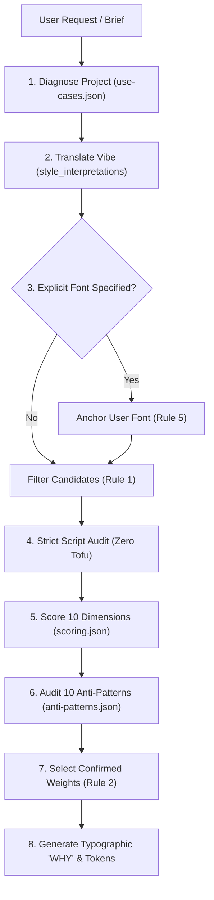

# Font Intelligence: Typography Decision System

[](.github/workflows/validate.yml)
[-blue?style=flat-square)](catalog/fonts.json)
[](docs/public-assets-manifest.md)
[](docs/v1-release-audit.md)
[](#installation)
[](#supported-agent-architecture)

An algorithmic typography decision system and font pairing engine for AI coding agents, UI/UX designers, and developers. Replaces generic defaults (Inter, Roboto, Arial) with mathematically scored, anti-pattern-checked typeface pairings backed by deep typographic rationales and copy-pasteable implementation tokens.

Each font retains its original license and redistribution terms are documented individually. Permissive open-source fonts are organized in `assets/fonts/` for immediate use, while catalog-only entries provide metadata for local design reasoning.

---

## 1. What Font Intelligence Is

Coding agents and developers frequently struggle with digital typography:
- They default to the same bland fonts (`Inter`, `Roboto`, `Arial`) regardless of brand tone or use case.
- They hallucinate weights that don't exist in font binaries (e.g., requesting `weight: 500` for a font that only has 700).
- They guess language script coverage, resulting in missing character boxes (**tofu**) on international scripts like Bangla or Arabic.
- They commit catastrophic typography anti-patterns, such as setting multi-paragraph body text in distressed display fonts or pairing competing novelty fonts.
- They assume "free for commercial use" allows raw binary redistribution on GitHub without checking license terms.

**Font Intelligence solves this.**

Font Intelligence operates as an algorithmic design partner:
1. **Diagnoses the Project**: Understands 29 use cases (SaaS, Fintech, Crypto, Fashion, Dashboards, Mobile, Pitch Decks, Resumes).
2. **Decodes Aesthetic Vibes**: Translates colloquial prompts ("expensive", "clean", "not AI-looking") into formal typographic classifications.
3. **Audits Language Scripts (Zero Tofu)**: Verifies OpenType binary tables. If an international script is unsupported locally, it strictly reports 0 local fonts and recommends verified open-source companion fonts (`Hind Siliguri`, `Noto Sans Bengali`, `Amiri`).
4. **Evaluates 10 Mathematical Dimensions**: Scores candidate pairs across Visual Contrast, Serif/Sans Dynamic, Personality Resonance, Readability, Width, Weight Availability, Role Compatibility, Project Style Fit, Language Parity, and Platform Suitability.
5. **Audits 10 Lethal Anti-Patterns**: Deducts severe penalties (-15 to -45 pts) for unreadable body text, uncanny sans mismatches, or weight starvation.
6. **Separates Public Assets**: Manages verified open-source fonts in `assets/fonts/` while preserving non-distributable packages safely as `catalog-only`.
7. **Delivers Calibrated Code Tokens**: Emits production-ready CSS Custom Properties, Flutter `pubspec.yaml`, React Native `StyleSheet`, and Microsoft Office TrueType embedding instructions.

---

## 2. Supported Agent Architecture

Font Intelligence follows a **single canonical truth** architecture. All coding agents share the exact same rules, catalog, and scoring engine:

```
CORE SKILL (.agents/skills/font-intelligence/SKILL.md)
  ├── Universal Entry   → AGENTS.md
  ├── Thin Adapters (Pointers only; never duplicate the skill):
  │   ├── Antigravity   → .agents/skills/font-intelligence/ & .agents/rules/font-intelligence.md
  │   ├── Claude Code   → CLAUDE.md
  │   ├── Codex         → AGENTS.md & .codex/instructions.md
  │   ├── Cursor        → .cursorrules & .cursor/rules/font-intelligence.mdc
  │   ├── Windsurf      → .windsurfrules
  │   ├── Cline         → .clinerules
  │   ├── GitHub Copilot→ .github/copilot-instructions.md
  │   └── Gemini CLI    → GEMINI.md
  ├── Compact Fallback  → lite/font-intelligence-lite.md (Cheatsheet for tight contexts)
  └── Canonical Data    → catalog/ (fonts, use-cases, pairings, scoring, anti-patterns)
```

No separate font databases or duplicate schemas are maintained across agents.

---

## 3. Installation & Getting Started

### Prerequisites
- Python 3.10, 3.11, or 3.12
- Optional: `fonttools` (for binary scanning tools)

```bash
# 1. Clone the repository
git clone https://github.com/ratulhub/font-intelligence.git
cd font-intelligence

# 2. (Optional) Install fonttools for binary inspection
pip install fonttools

# 3. Install platform adapters (Antigravity, Cursor, Claude, Windsurf, Cline, Copilot, Codex, Gemini)
# Bash (Linux/macOS):
./install.sh all
# PowerShell (Windows):
.\install.ps1 -Target all
```

### Comprehensive Platform & Typography Manuals
Explore deep reference guides in [`references/`](references/):
- **Typography & Scale**: [`typography-rules.md`](references/typography-rules.md), [`pairing-rules.md`](references/pairing-rules.md), [`accessibility.md`](references/accessibility.md)
- **Web & Frameworks**: [`web.md`](references/web.md), [`react.md`](references/react.md), [`nextjs.md`](references/nextjs.md), [`tailwind.md`](references/tailwind.md)
- **Mobile**: [`flutter.md`](references/flutter.md), [`react-native.md`](references/react-native.md), [`android.md`](references/android.md), [`ios.md`](references/ios.md)
- **Documents & Slides**: [`presentations.md`](references/presentations.md), [`documents.md`](references/documents.md), [`branding.md`](references/branding.md)

### Launch Interactive Visual Studio
Font Intelligence includes an interactive, zero-dependency typography preview studio:
```bash
python -m http.server 8080
```
Open **`http://localhost:8080/preview/index.html`** in your browser to inspect all 413 families, filter by role/readability/style, and test interactive type specimens.

---

## 4. How Font Selection Works

Font Intelligence follows a strict 10-step protocol:



### Colloquial Style Decoder
- **"Expensive / Luxury"**: High stroke contrast (Didone serif or sculpted display sans) + light/medium headline weights + wide all-caps tracking (`+0.05em`) + neutral sans body.
- **"Clean / Minimalist"**: Unadorned neo-grotesque + open apertures + consistent monoline strokes + generous line-height (`1.6+`).
- **"Not AI-Looking / Distinctive"**: Eliminates flat Inter defaults. Pairs character-rich display cuts (`Ithaca`, `Chillax`, `Credit Valley`, `Reckoner`) with a 200–300 weight delta and optical tracking.
- **"Technical / Developer"**: High x-height sans + tabular figures (`tnum`) + unambiguous monospaced glyphs (`Ubuntu Mono`).

---

## 5. How Pairing Works: 10-Dimensional Scoring Engine

Every combination is evaluated across 10 mathematical dimensions with weighted scoring:

| # | Dimension | Weight | Evaluation Criteria |
| :-: | :--- | :-: | :--- |
| **1** | **Visual Contrast** | 15% | Stroke weight delta ($\ge 200$ units), classification contrast (Serif + Sans). |
| **2** | **Serif/Sans Dynamic** | 12% | Harmony between structural skeleton and optical cadence. |
| **3** | **Personality Resonance**| 12% | Alignment of cultural, historical, and emotional archetypes. |
| **4** | **Readability / Legibility**| 15% | X-height, aperture openness, and continuous reading endurance ($\ge 7/10$). |
| **5** | **Proportional Width** | 8% | Aspect ratio optical balance; prevents cramped headlines over wide body. |
| **6** | **Weight Availability**| 10% | Superfamily depth, variable axes, confirmed true italics. |
| **7** | **Role Compatibility** | 10% | Suitability for designated typographic role (Display $\neq$ Body). |
| **8** | **Project Style Fit** | 8% | Direct semantic alignment with use-case design goals. |
| **9** | **Language / Script Parity**| 5% | Zero tofu tolerance; full glyph parity across all target languages. |
| **10**| **Platform Suitability**| 5% | Web payload (< 100 KB), Flutter rendering, PowerPoint TrueType outline checks. |

### Anti-Pattern Prevention (Penalties)
Combinations triggering anti-patterns receive severe point deductions:
- ❌ **Decorative as Body** (-45 pts): Never use display or handwriting fonts for paragraphs.
- ❌ **Competing Display Fonts** (-30 pts): Only one vocal visual lead in a hierarchy.
- ❌ **Weak Contrast / Flat Hierarchy** (-25 pts): Requires $\ge 200$-unit weight delta.
- ❌ **Excessive Font Families** (-25 pts): Maximum 2 primary families (plus monospace only for code).
- ❌ **Script Mismatch / Zero Tofu** (-45 pts): Refuses to guess unverified scripts.
- ❌ **Low x-Height in UI Microcopy** (-20 pts): Enforces open apertures for 11–13px buttons/badges.
- ❌ **Hairline Screen Fatigue** (-20 pts): Prohibits 100/200 weights for continuous screen body text.
- ❌ **Monospace Longform Fatigue** (-15 pts): Restricts monospace to code snippets and tabular data.
- ❌ **Uncanny Sans Mismatch** (-15 pts): Prevents pairing two near-identical neo-grotesques.
- ❌ **Personality Polar Clash** (-25 pts): Forbids conflicting tones (e.g. Luxury Serif + Street Graffiti).

---

## 6. Fast CLI Execution

Run supporting tools directly from your terminal:

```bash
# 1. Recommend Pairings from Project Brief
python scripts/recommend.py --use-case fintech --style "expensive, not AI-looking" --platform web

# 2. Anchor Around an Explicit User Font Choice (Hard Rule 5)
python scripts/recommend.py --use-case saas --anchor "Chillax"

# 3. Integrate Non-Destructively with an Existing Design System (Hard Rule 6)
python scripts/recommend.py --use-case ecommerce --existing-fonts "Inter, Roboto"

# 4. Search Catalog by Mood, Role, and Script
python scripts/search_fonts.py --mood "clean" --role body --min-readability 8 --script Latin

# 5. Score a Specific Font Pair (10 Dimensions + Anti-Patterns)
python scripts/score_pair.py --primary chillax --secondary general-sans --style luxury

# 6. Export Selected Font Binaries and Generate CSS / Flutter Snippets
python scripts/copy_fonts.py --fonts "chillax,general-sans" --dest "dist/fonts" --snippets all

# 7. Validate Entire Catalog Schema & References
python scripts/validate_catalog.py

# 8. Audit Licensing, Commercial Terms, and PowerPoint Embeddability
python scripts/validate_licenses.py --filter issues-only
```

---

## 7. Hard Non-Negotiable Rules

1. **Never invent catalog fonts**: Only recommend real, verified fonts from `catalog/fonts.json`.
2. **Never invent weights**: Only specify weights listed in `technical.weights`.
3. **Never invent language support**: Zero tofu tolerance. For Bangla, Arabic, etc., recommend verified external companion fonts (`Hind Siliguri`, `Noto Sans Bengali`, `Amiri`).
4. **Never assume commercial use = GitHub redistribution**: Verify license grants before redistributing font files. See [`docs/redistribution-review.md`](docs/redistribution-review.md).
5. **Respect explicit user font choices**: If the user asks for a font, adopt it and pair around it. Never override user selections.
6. **Do not replace existing typography systems**: Integrate with existing fonts; never overwrite unprompted.
7. **No decorative fonts for body text**: Display, script, and decorative typefaces must never be assigned to `body` or `ui` roles.
8. **Maximum of 2 primary families**: 1 heading + 1 body/UI (plus monospace only when code/data is present).
9. **Enforce readability scores $\ge 7/10$** for body and UI.
10. **Respect platform constraints**: Payloads < 100 KB for Web (WOFF2); TrueType (`.ttf`) outlines for Microsoft Office to avoid substitution bugs.
11. **Always generate calibrated system fallbacks**.

---

## 8. Licensing & Redistribution Terms

All 413 font families in Font Intelligence are cataloged with verified licensing terms and clear separation of concerns:

- **Open Source (108 Families)**: Distributed under SIL Open Font License (OFL 1.1), Apache 2.0, MIT, Ubuntu Font License, or Creative Commons Zero (CC0).
- **Free for Commercial Use (390 Families)**: Explicitly approved for commercial project use.
- **Redistributable Public Assets (112 Families)**: Verified font packages safe for repository redistribution located in `assets/fonts/`.
- **Personal Use Only (23 Families)**: Preserved for local design evaluation.

Refer to [`docs/redistribution-review.md`](docs/redistribution-review.md) and [`docs/public-assets-manifest.md`](docs/public-assets-manifest.md) for full licensing records.

---

## 9. How to Validate & Contribute

### Pre-Push Validation Checklist
Before pushing code or publishing updates, run the complete validation suite:
```bash
# 1. Schema, ID, and File Path Validation
python scripts/validate_catalog.py

# 2. Licensing Audit
python scripts/validate_licenses.py --filter issues-only

# 3. Comprehensive Domain Test Suites (58 tests: catalog, licensing, languages, 20 projects, 17 negative cases)
python -m unittest discover -s tests -p "test_*.py"

# 4. CLI Tools & Engine Test Suites (23 tests)
python -m unittest discover -s scripts -p "test_*.py"

# 5. Real-User Evaluation Matrix (24/24 tests)
python scripts/run_evaluation_matrix.py
```

For guidelines on adding new fonts, project use cases, or curated pairings, please read [`CONTRIBUTING.md`](CONTRIBUTING.md).

---

## 10. License

The Font Intelligence software engine, scripts, decision models, and agent skill files are licensed under the [MIT License](LICENSE). Individual font binaries in `All fonts/` retain their original respective foundry licenses (OFL, Apache, CC0, Freeware) as documented in `catalog/fonts.json`.
