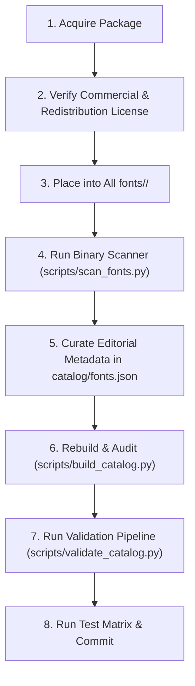

# Standardized Add-Font Workflow

This guide details the step-by-step procedure for expanding the Font Intelligence catalog with new font families.

---

## The 8-Step Pipeline



---

### Step 1: Legal License Verification
Before touching any files, verify that the font license grants:
1. **Commercial Use**: Creation of commercial products, web UI, mobile apps, and slide decks.
2. **Redistribution Rights**: Permission to host/bundle font binary files in public Git repositories without requiring end-user fee payment.
- Preferred: SIL Open Font License 1.1 (`OFL-1.1`), Apache 2.0 (`Apache-2.0`), MIT, or Creative Commons Zero (`CC0-1.0`).
- If restricted or unknown: Do **not** commit the raw binaries to public repositories; follow [docs/redistribution-review.md](file:///d:/font-intelligence/docs/redistribution-review.md).

### Step 2: Source Package Preservation
Place the unaltered foundry package in `All fonts/<family-id>/`:
```
All fonts/<family-id>/
├── <family-id>-Regular.ttf
├── <family-id>-Bold.ttf
├── OFL.txt (or LICENSE.txt)
└── README.txt (if provided)
```
> **Rule**: Never delete original foundry readme, license, or specimen files.

### Step 3: Run Binary Metadata Scanner
Extract OpenType `cmap`, `name`, `OS/2`, and `head` tables into raw metadata:
```bash
python scripts/scan_fonts.py --source "All fonts/<family-id>" --update-catalog
```

### Step 4: Curate Editorial Intelligence
Open `catalog/fonts.json` and calibrate the non-algorithmic editorial fields:
- **`curated.category`**: `serif`, `sans-serif`, `display`, `monospace`, or `handwriting`.
- **`curated.subtype`**: Pick from [catalog/vocabularies.json](file:///d:/font-intelligence/catalog/vocabularies.json) (e.g. `geometric`, `neo-grotesk`, `editorial`).
- **`curated.styles`**: Controlled tags (`modern`, `luxury`, `technical`, `brutalist`, etc.).
- **`curated.roles`**: Allowed typography roles (`hero`, `heading`, `body`, `ui`, `number`).
- **`curated.readability`**: Calibrate scores from 1 to 10 for `body`, `ui`, `small_text`, `long_form`, `numbers`.
  *(Enforce: Display fonts must have `body <= 4` and must not have role `body`)*.
- **`curated.fallback`**: Standard system font fallback stack.

### Step 5: Update License Tracking
Populate the `license.tracking` object:
```json
"tracking": {
  "license_name": "SIL Open Font License 1.1",
  "spdx_id": "OFL-1.1",
  "commercial_use": true,
  "redistribution": true,
  "modification": true,
  "license_file": "All fonts/<family-id>/OFL.txt",
  "source": "<Foundry / Designer>",
  "source_url": "https://...",
  "verification_status": "verified",
  "verification_date": "2026-09-29",
  "redistribution_notes": "Permitted to bundle and redistribute under OFL-1.1."
}
```

### Step 6: Rebuild Canonical Catalog & Preview
```bash
python scripts/build_catalog.py
python scripts/generate_preview.py
```

### Step 7: Run Validation Pipeline
```bash
python scripts/validate_catalog.py
python scripts/validate_licenses.py --filter issues-only
```

### Step 8: Run Complete Test Suite
```bash
python -m unittest discover -s scripts -p "test_*.py"
python scripts/run_evaluation_matrix.py
```
If all checks pass with **0 errors**, stage and commit the new family.
